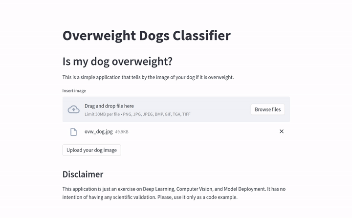

# Overweight Dogs Image Classifier



A simple example of a PyTorch image classifier to classify images of overweight dogs. The model is a pretrained EfficientNet-B0 with a custom classify layer on top.

The dataset was built scraping Bing Image for terms like "overweight dogs", "obese dogs" and similars. I also wrote some scripts to extract frames of videos containing overweighted dogs to achieve a more robust dataset.
The dataset is composed of 5400 images already randomly split into train, validation, and test folders.
It can be downloaded here: https://drive.google.com/file/d/1uFDfpyCkMxzdz2Mez5zUBJJHBkh_OJjq/view?usp=sharing

Just for the sake of completeness (and fun!) I added an API call to the AWS Rekognition Label Detection service, so our model is called only when a dog is in the picture. That way our application can function as an object detector too.

A simple Streamlit frontend was built to simplify the use of the model by clients. The model is integrated with FastAPI, and can be accessed on the /prediction endpoint. It is already deployable via Docker and has GPU support if needed.

The application is also already deployable on AWS ECS.

## How To Use

To clone and run this application, you'll need [Git](https://git-scm.com) and [Docker](https://docs.docker.com/get-docker/):

```bash
# Clone this repository
$ git clone https://github.com/daniabib/overweight-dogs

# Go into the repository
$ cd overweight-dogs
```

Then you need to build and run the Docker image:
```bash
# Build and run the image
$ docker-compose up -d --build
```
The Streamlit frontend will be avaiable at http://localhost:8501.

To test the model you can use the FastAPI documentation page. It will be avaiable on http://0.0.0.0:8080/docs.

You can also use a HTTP client like [httpie](https://httpie.io/), for example:
```bash
$ http --form http://0.0.0.0:8080/prediction raw_image@dog-image-example.jpg
```

It will return something like this:
```bash
HTTP/1.1 200 OK
content-length: 25
content-type: application/json
date: Fri, 18 Mar 2022 21:09:45 GMT
server: uvicorn

{
    "category": "overweight"
}
```
## Things I'm still implementing 
- ~~A simple Streamlit frontend.~~ ✅
- ~~A docker-compose pipeline to simplify deployment on AWS ECS.~~ ✅

<!-- ## Support

<a href="https://www.buymeacoffee.com/danielabib?" target="_blank"></a> -->


## Disclaimer
This repository is just an exercise on deep learning, computer vision, and model deployment. It has no intention of having any scientific validation. Please, use it only as a code example.
